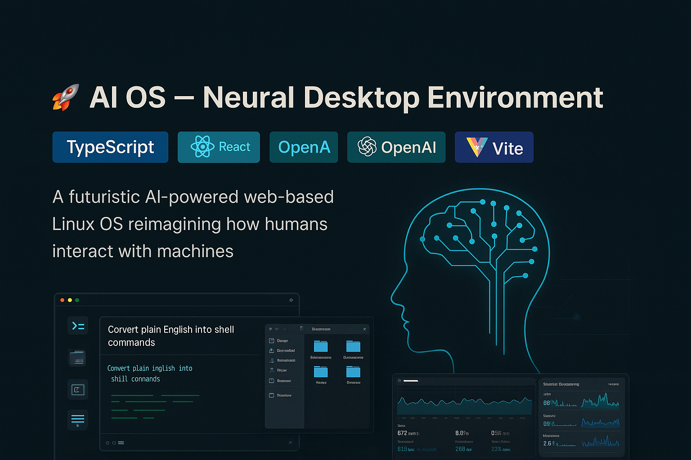

 AI OS – Neural Desktop Environment


<div align="center">
  
</div>

 Overview

AI OS is a sophisticated full-stack web application that simulates a complete Linux-like desktop environment enhanced with cutting-edge artificial intelligence capabilities. This project showcases how AI can revolutionize traditional operating system interactions, making complex tasks intuitive and accessible through natural language processing.
 
 Vision

This project demonstrates the potential future of operating systems where artificial intelligence seamlessly integrates with traditional computing paradigms, creating a more intuitive, efficient, and powerful user experience.

 Key Features

 Desktop Environment
- **Multi-Window System**: Full-featured window manager with draggable, resizable windows
- **Linux-Style Interface**: Authentic desktop experience with taskbar and system tray
- **Real-time System Monitoring**: Live performance metrics and resource usage
- **Responsive Design**: Optimized for various screen sizes and devices

 AI-Powered Components

 AI Terminal
- **Natural Language Processing**: Convert plain English commands to bash operations
- **Command Interpretation**: Intelligent understanding of user intent
- **Real-time Execution**: Seamless translation and execution of system commands
- **Context Awareness**: Maintains command history and environmental context

 AI Assistant
- **Conversational Interface**: Natural dialogue for system help and guidance
- **System Integration**: Deep understanding of the OS environment
- **Problem Solving**: Intelligent troubleshooting and optimization suggestions
- **Learning Capabilities**: Adapts to user patterns and preferences

 Intelligent File Management
- **AI-Powered Search**: Semantic file search with relevance ranking
- **Content Analysis**: Automatic file categorization and insights
- **Smart Organization**: Intelligent folder structure recommendations
- **Predictive Navigation**: Anticipates user file access patterns

 AI Code Editor
- **Real-time Code Analysis**: Instant syntax checking and error detection
- **Intelligent Suggestions**: Context-aware code completion and improvements
- **Multi-language Support**: Comprehensive programming language coverage
- **Performance Optimization**: Code quality analysis and enhancement recommendations

 Security & Access Control
- **OAuth Authentication**: Secure login via Replit Auth
- **Permission-based Access**: Granular user permission management
- **Session Management**: Secure, persistent user sessions
- **Data Protection**: Encrypted data storage and transmission

 Real-time Communication
- **WebSocket Integration**: Live system updates and notifications
- **Multi-user Support**: Collaborative environment capabilities
- **Instant Synchronization**: Real-time file and system state updates
- **Performance Streaming**: Live system metrics broadcasting

 Technical Architecture

 Frontend Stack
- **React 18** with TypeScript for type-safe development
- **Vite** for lightning-fast development and optimized builds
- **Tailwind CSS** with custom design system
- **Radix UI** primitives for accessible component foundation
- **TanStack Query** for efficient server state management
- **Wouter** for lightweight client-side routing

 Backend Infrastructure
- **Node.js** with Express.js for robust server architecture
- **PostgreSQL** with Drizzle ORM for reliable data persistence
- **OpenAI API** integration for advanced AI capabilities
- **WebSocket** server for real-time bidirectional communication
- **Session Management** with PostgreSQL-backed storage

 AI Integration
- **OpenAI GPT-4** for natural language processing
- **Command Interpretation Engine** for bash translation
- **Semantic Search** for intelligent file discovery
- **Code Analysis** for development assistance
- **System Optimization** for performance enhancement

 Getting Started

 Prerequisites
- Node.js 18+ 
- PostgreSQL database
- OpenAI API key
- Modern web browser with WebSocket support

### Installation

1. **Clone the repository**
   ```bash
   git clone https://github.com/manasvi-gowda/ai-os.git
   cd ai-os
   ```

2. **Install dependencies**
   ```bash
   npm install
   ```

3. **Environment Configuration**
   Create a `.env` file with the following variables:
   ```env
   DATABASE_URL=your_postgresql_connection_string
   OPENAI_API_KEY=your_openai_api_key
   SESSION_SECRET=your_session_secret
   REPLIT_DOMAINS=your_domain
   ```

4. **Database Setup**
   ```bash
   npm run db:push
   ```

5. **Start the application**
   ```bash
   npm run dev
   ```

6. **Access the application**
   Open your browser to `http://localhost:5000`

##  Usage Guide

### Authentication
1. Navigate to the application URL
2. Click "Login" to authenticate via OAuth
3. Access your personalized desktop environment

### AI Terminal Usage
```bash
# Natural language commands
"show me all text files"
"create a new folder called projects"
"find files modified today"
"compress the documents folder"
```

### AI Assistant Features
- Type questions in natural language
- Get system help and guidance
- Receive optimization suggestions
- Access contextual documentation

### File Management
- Drag and drop file operations
- AI-powered search with semantic understanding
- Intelligent file categorization
- Real-time collaboration capabilities

##  Development

### Project Structure
```
ai-os/
├── client/                 # React frontend application
│   ├── src/
│   │   ├── components/     # Reusable UI components
│   │   ├── pages/         # Application pages
│   │   ├── hooks/         # Custom React hooks
│   │   └── lib/           # Utility functions
├── server/                 # Node.js backend
│   ├── routes.ts          # API endpoint definitions
│   ├── storage.ts         # Database operations
│   ├── aiService.ts       # AI integration logic
│   └── index.ts           # Server entry point
├── shared/                 # Shared TypeScript types
└── database/              # Database schema and migrations
```

### Key Technologies
- **TypeScript** for type safety across the full stack
- **Drizzle ORM** for database operations and migrations
- **OpenAI API** for advanced AI capabilities
- **WebSocket** for real-time communication
- **React Query** for server state management

##  Contributing

This project represents a vision for the future of operating systems. Contributions are welcome to help realize this vision:

1. Fork the repository
2. Create a feature branch (`git checkout -b feature/amazing-feature`)
3. Commit your changes (`git commit -m 'Add amazing feature'`)
4. Push to the branch (`git push origin feature/amazing-feature`)
5. Open a Pull Request

##  License

This project is licensed under the MIT License - see the [LICENSE](LICENSE) file for details.

##  About the Developer

**Manasvi Gowda P** - Full-stack developer passionate about creating innovative solutions that bridge the gap between artificial intelligence and traditional computing paradigms.

[](https://deploy.cloud.run/?git_repo=https://github.com/Manasvi-1/ai-os&dir=server)


---

<div align="center">
  <p>⭐ Star this repository if you find it interesting!</p>
  <p>Built with necessity by Manasvi Gowda P</p>
</div>


